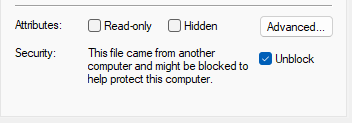

# Fence Replanner
A Mission Planner plugin 
[LICENSE](https://github.com/ArduPilot/MissionPlanner/blob/master/COPYING.txt)

## Installation

- Copy the latest `FenceReplanner.dll` from [Releases](https://github.com/yuri-rage/mission-planner-fence-replanner/releases) to your Mission Planner installation directory.
	- Typically `C:\Program Files (x86)\Mission Planner\plugins\`
- Windows may automatically block the unsigned library file. To unblock it, right click the filename in Windows Explorer and select "Properties." Then check "Unblock" and click "Ok."

	

- Restart Mission Planner if it was already open.

## Usage

- Open Mission Planner's "PLAN" tab and create fences around obstacles/avoid areas if they are not already uploaded to a connected vehicle.
- Right click on the map, and select "Fence Replanner -> Options"
	- **Arc Segment Length:** Fence Replanner will convert circular fences to polygons. This is the target distance between waypoints around the converted circle.
	- **Fence Margin:** The desired margin by which to avoid fences.
	- **Min WP Distance:** Consecutive waypoints less than this distance apart will be removed during replanning.
	- Close the dialog box.
		- (these options are saved for future use, even after Mission Planner is closed)
- Optionally:
	- Draw a polygon for use with survey grid mission creation.
	- Right click the map and select "Fence Replanner -> Trim Polygon" to trim the polygon around fences that intersect its edges.
- Create a waypoint mission
- Right click the map and select "Fence Replanner -> Replan Mission" to reroute the mission around fences using the selected options.
- **CRITICAL:** Check that the newly replanned mission never inadvertently crosses exclusion zones.

> NOTE: If not connected to a vehicle, fences will disppear from view when switching back to "MISSION" planning mode. Edited fences will remain in memory for use with the Fence Replanner despite not being shown on screen.

## Known Issues

### Possible fence incursions:

The replanner does three passes through the mission:
1. Checks for waypoints that fall within fences and reroutes accordingly
2. Checks for complete segments that intersect fences and reroutes accordingly
3. Culls waypoints that fall within the minimum distance specified

As a result of these somewhat independent operations, *<u>rerouted paths may cross fence boundaries.</u>* It is *ALWAYS* up to the user to ensure that created mission(s) do not enter exclusion zones.

### No altitude awareness:
**WARNING:** This plugin is not altitude aware, and all waypoint altitudes will be zeroed after clicking "Replan Mission."

The primary use case for this plugin is ArduPilot Rover. Waypoint altitude preservation (and possibly 3D replanning) may be included in a future release.

### Mission commands removed:

The replanner only considers waypoint mission items and removes mission commands (like camera triggers).